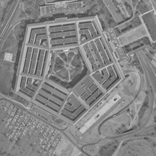
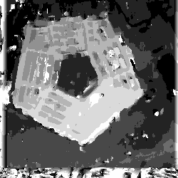

# stereo-disparity-map

Computes a disparity map from a stereo pair of black and white images.

### Use

    PIXEL_DISP(leftImage, rightImage, outputImage, plot, greyscale, scan_window_size, support_scale);

e.g.

    PIXEL_DISP('IN/pentagon_right.bmp', 'IN/pentagon_left.bmp', 'OUT/Pentagon_7_3', 0, 1, 7, 3);

### Example Stereo Pair & Resulting Disparity Map
  

### Algorithm Summary

    read in L and R images and if necessary, convert both to greyscale

      loop for each pixel in the left image

          generate matrix of left scan window for the current pixel

          calculate boundaries for the large right support window

          generate matrix of large right support window

          begin loop for each pixel in the large right support window

              get matrix of scan window size for the current pixel in support window

              calculate disparity by performing sum of squared differences

              if the disparity for the current right scan window is closer to 0 then

              note disparity and x value within the right support window

          end loop

          calculate the vector from the current row point to closest disparity match

          map the value between 0-255 for display purposes

          add value to array of disparity map array

      end loop

      write image out

    end

